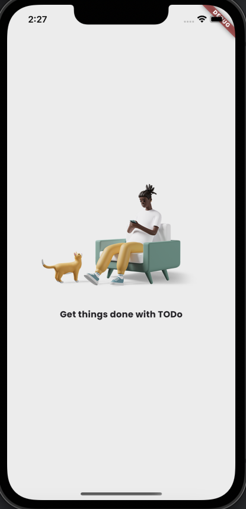
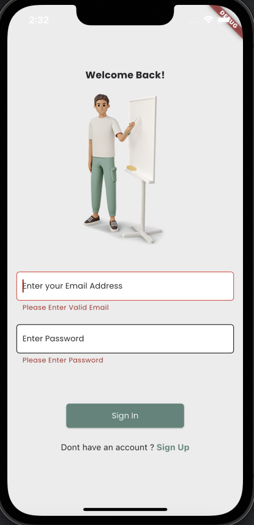
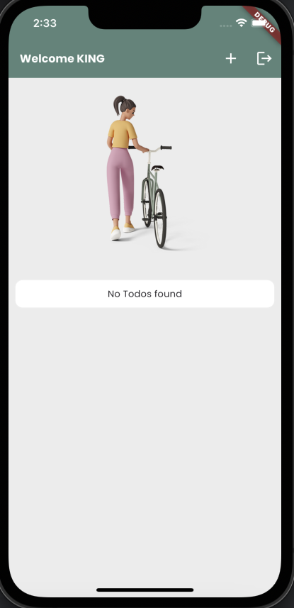
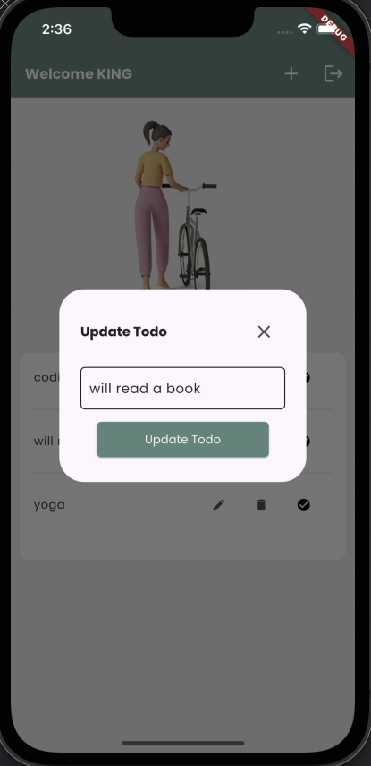
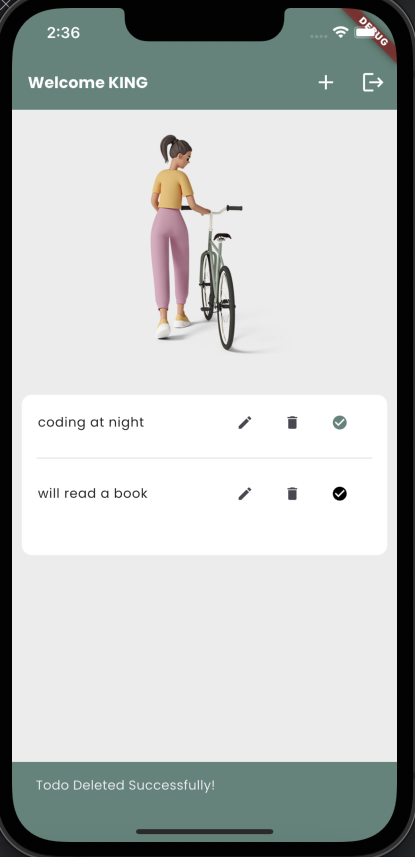
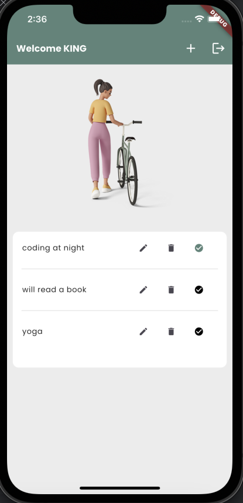

---

# Todo App with BLoC State Management

A Flutter-based Todo application designed to provide a seamless task management experience. Built using **BLoC (Business Logic Component)** state management, the app ensures performance, scalability, and maintainability. Data security is prioritized with hashed passwords stored in secure storage.

---

## 🛠️ Features

### User Authentication
- **Splash Screen**: Welcomes the user with an initial splash screen.
- 
- **Signup**: Users can create a new account to get started.
- 
- **Login**: Existing users can securely log in using their credentials.
- 
- **Secure Data Storage**:
    - User credentials are stored securely using `flutter_secure_storage`.
    - Passwords are hashed using the `bcrypt` package.

### Todo Management
- **Welcome Screen**: Displays a personalized welcome message with the user's name.
- 
- **Empty State**: Shows `No Todos Found` if there are no tasks.
- **Add Todos**: Create new tasks using a pop-up with a text field and an "Add Todo" button.
- 
- **Edit Todos**: Update existing tasks directly from the Todo screen.
- 
- **Delete Todos**: Remove tasks you no longer need.
- 
- **Complete Todos**: Mark tasks as completed to track progress.
- 

### Data Storage
- **Persistent Data**: Todos are stored locally using the `hive` database.
- **Hive Integration**: All data is fetched and updated directly from Hive for efficiency.

---

## 🧰 Technologies and Packages

### Core Technologies
- **Flutter**: Cross-platform framework for mobile app development.
- **BLoC**: Business Logic Component for state management.

### Dependencies
- `flutter_bloc`: For managing state efficiently.
- `hive` & `hive_flutter`: For local data storage.
- `flutter_secure_storage`: To securely store user credentials.
- `bcrypt`: For hashing user passwords.
- `encrypt`: For additional data security.
- `flutter_lints`: To enforce good coding practices.

### Dev Dependencies
- `hive_generator`: Code generation for Hive.
- `build_runner`: To generate type adapters for Hive.

---

## 🚀 Getting Started

### Prerequisites
- Flutter SDK: ^3.5.4 or later
- A code editor like **VS Code** or **Android Studio**

### Installation

1. Clone the repository:
   ```bash
   git clone https://github.com/parasbhanot938/tic_tac_toe.git
   cd to_do_app
   ```

2. Install dependencies:
   ```bash
   flutter pub get
   ```

3. Run the app:
   ```bash
   flutter run
   ```

---

## 📂 Project Structure

```
lib/
├── bloc/              # Contains BLoC files for state management
├── constants/         # Contains constants files like app colors, app images
├── data/              # Contains repos like auth repo & todo repo with respective providers
├── model/             # Data models for todos
├── repo/       # Business logic and Hive integration
├── ui/            # UI screens (Splash, Signup, Login, Todo Screen)
├── widgets/            # Reusable UI components
└── main.dart           # App entry point
```

---

## 📦 Assets

- **Images**: Stored in `assets/images/`.
- **Fonts**: Custom fonts (`Poppins`) stored in `assets/fonts/`.

To add or modify assets, update the `pubspec.yaml` file.

---

## 🎨 UI Flow

1. **Splash Screen**: A welcoming screen with the app logo or animation.
2. **Signup/Login**: Options for user authentication.
3. **Todo Screen**: Displays todos with options to add, edit, delete, or complete tasks.

---

## 🛡️ Security Features
- Passwords are hashed using the `bcrypt` package before storage.
- User credentials are securely stored using `flutter_secure_storage`.

---

## 🛠️ Development Commands

### Code Generation
Generate Hive type adapters:
```bash
flutter pub run build_runner build
```

---


